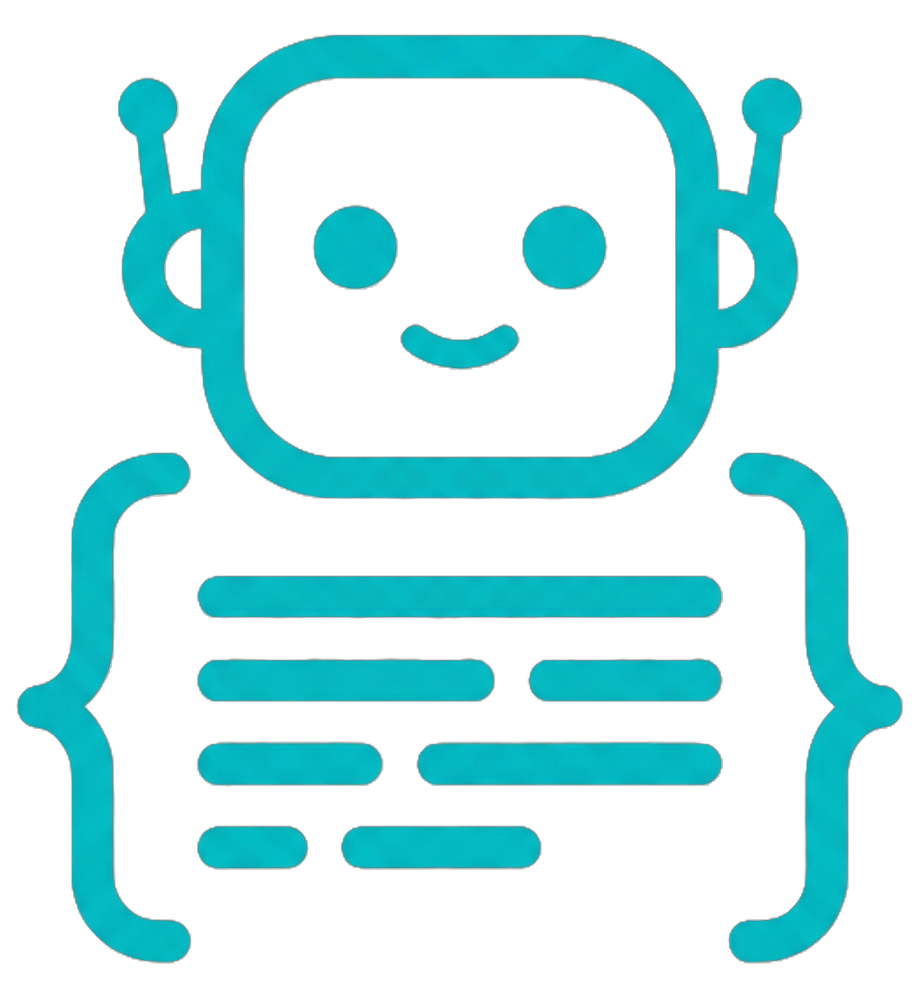

# Decodie

Your AI learning companion. This repo hosts the [Decodie website](https://decodie.owenbush.dev), which explains the project and how to get started.

## Repositories

| Repo | Description |
|------|-------------|
| [decodie-skill](https://github.com/owenbush/decodie-skill) | Claude Code skill that generates learning entries |
| [decodie-ui](https://github.com/owenbush/decodie-ui) | Presentation layer (Node.js web app) |
| [decodie-ddev](https://github.com/owenbush/decodie-ddev) | DDEV add-on |

## Development

This is a static site — just open `index.html` in a browser. Deployed to GitHub Pages automatically on push to `main`.
